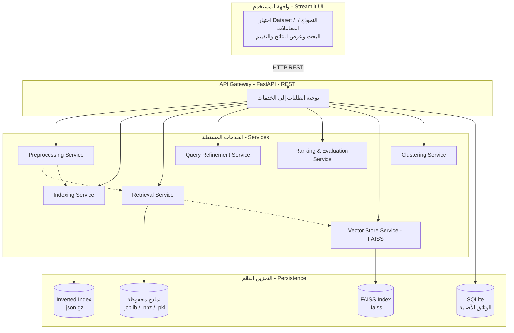

# مشروع عملي نظم استعجاع المعلومات 2026
## بناء نظام استرجاع معلومات (Information Retrieval System)

---

## 1. مقدمة ووصف المشروع

الهدف من المشروع بناء محرك بحث (Search Engine) قادر على استرجاع الوثائق ذات الصلة من
مجموعتي بيانات مختلفتين، اعتمادًا على مبادئ استرجاع المعلومات (IR). يتعامل النظام مع
استعلامات المستخدم ويُعيد النتائج المرتّبة حسب درجة التشابه باللغة الطبيعية نصيًا.

صُمِّم النظام وفق معمارية الخدمات (Service Oriented Architecture - SOA)، حيث قُسِّم إلى
خدمات مستقلة، كل خدمة مسؤولة عن مهمة محددة وقابلة للتشغيل والاختبار بشكل منفصل، مع بوابة
API موحّدة (FastAPI) وواجهة مستخدم (Streamlit).

**لغة العمل:** Python حصرًا.

---

## 2. وصف مجموعات البيانات (Datasets)

بُني النظام على **مجموعتي بيانات** من [ir-datasets](https://ir-datasets.com)، وكلتاهما
تحتويان على أكثر من 200 ألف وثيقة وعلى بيانات اختبار (queries + qrels):

| الخاصية | `beir/webis-touche2020` | `beir/quora/test` |
|---------|--------------------------|--------------------|
| عدد الوثائق | 382,545 | 522,931 |
| عدد الاستعلامات | 49 | 10,000 |
| عدد أحكام الصلة (qrels) | 2,962 | — |
| طبيعة البيانات | مقالات/حجج جدلية (مواضيع نقاش) | أسئلة من موقع Quora (تكرار الأسئلة) |
| الاستخدام | بحث في نصوص طويلة | كشف تشابه دلالي بين أسئلة قصيرة |

> ملاحظة: مُنع استخدام مجموعة Antique. المجموعتان المختارتان متوافقتان مع شرط أكثر من
> 200 ألف وثيقة لكل مجموعة، ووجود بيانات اختبار وأحكام صلة.

---

## 3. خطوات المشروع وكل خدمة (Services)

النظام مقسّم إلى الخدمات المستقلة التالية (مجلد `services/`):

### 3.1 خدمة المعالجة المسبقة — `preprocessing.py`
تطبّق سلسلة معالجة موحّدة على الوثائق والاستعلامات معًا لضمان التوافق:
1. تحويل لأحرف صغيرة (Lowercasing)
2. إزالة علامات الترقيم والأرقام
3. تطبيع المسافات (Normalization)
4. التقطيع (Tokenization)
5. إزالة كلمات الوقف (Stopwords removal)
6. الاشتقاق المعجمي (Lemmatization - WordNetLemmatizer)
7. التجذيع (Stemming - PorterStemmer)

### 3.2 خدمة الفهرسة — `indexing.py`
تبني **فهرسًا معكوسًا (Inverted Index)** بالبنية `term → {doc_id: term_frequency}`،
مع حفظ أطوال الوثائق وعدد الوثائق لحساب إحصائيات TF/DF. يدعم الفهرس الحفظ على القرص
بصيغة مضغوطة (`.json.gz`) واسترجاعه بسرعة، إضافة لعمليات Boolean (AND/OR) والبحث عن
المصطلحات.

### 3.3 خدمة الاسترجاع — `retrieval.py`
تحتوي نماذج التمثيل والبحث (انظر القسم 5).

### 3.4 خدمة الترتيب والتقييم — `evaluation.py`
تحسب مقاييس التقييم القياسية (MAP, Recall, P@10, nDCG) مع تسجيل مفصّل لكل استعلام.

### 3.5 خدمة تحسين الاستعلام — `query_refinement.py`
تطبيع + تصحيح إملائي + اقتراح مفردات من الفهرس + توسيع بالاستعلام عبر
Pseudo Relevance Feedback (PRF).

### 3.6 خدمة معالجة الاستعلام — `query_processing.py`
تُظهر خطوات تحويل الاستعلام وتطبّق نفس تقنيات المعالجة المسبقة المستخدمة للوثائق.

### 3.7 خدمة تخزين الوثائق — `document_store.py`
قاعدة بيانات **SQLite** تخزّن النص الأصلي الكامل لكل وثيقة، وتُستعمل لعرض الوثيقة كاملةً
في الواجهة عند الطلب (لا تُخزَّن النصوص في الذاكرة فقط).

### 3.8 خدمة الحفظ والاسترجاع — `persistence.py`
تبني كل النماذج **مرة واحدة عند تحميل المجموعة** وتحفظها على القرص بصيغ مضغوطة
(`.joblib`, `.npz`, `.pkl`)، فلا تُدرَّب النماذج عند أول استعلام بل تُحمَّل جاهزة.

### 3.9 بوابة الـ API — `api/main.py`
خدمة **FastAPI** توحّد الوصول لكل الخدمات عبر REST.

### 3.10 واجهة المستخدم — `ui/app.py`
واجهة **Streamlit** تتواصل مع البوابة عبر REST.

---

## 4. بنية النظام والتواصل بين الخدمات (SOA Architecture)

### 4.1 المخطط المعماري



### 4.2 آلية التواصل
- أسلوب التواصل بين الواجهة والخدمات: **REST API** (HTTP/JSON) عبر بوابة FastAPI.
- كل خدمة معزولة في وحدة (module) مستقلة ضمن `services/`، قابلة للاستيراد والاختبار منفردة.

### 4.3 مبرّرات اختيار البنية والتقنيات
- **FastAPI**: أداء عالٍ، توثيق تلقائي (Swagger على `/docs`)، تحقق من الأنواع عبر Pydantic.
- **Streamlit**: بناء واجهة تفاعلية سريعة بلغة Python نفسها.
- **SQLite**: تخزين خفيف للوثائق دون خادم منفصل، يحقق فصل التخزين عن المعالجة.
- **الحفظ على القرص (Persistence)**: يُجنّب إعادة تدريب النماذج عند كل تشغيل، ويحسّن زمن
  الاستجابة (يُدرَّب مرة، يُحمَّل لاحقًا).
- **مبادئ محقَّقة**: فصل واضح للمسؤوليات، Loose Coupling، قابلية إعادة الاستخدام
  (Reusability)، قابلية الصيانة (Maintainability)، وقابلية التوسّع (Scalability) عبر إضافة
  خدمات جديدة دون المساس بالقائمة.

---

## 5. تمثيل الوثائق ونماذج الاسترجاع

طُبِّقت كل طرق التمثيل المطلوبة، وكل نموذج ينفّذ خطوتي **المطابقة (Matching)** و**الترتيب (Ranking)**:

### 5.1 TF-IDF (VSM)
- التمثيل: كل وثيقة شعاع أوزان TF-IDF (Vector Space Model).
- المطابقة: **Cosine Similarity** بين شعاع الاستعلام وأشعة الوثائق.
- الترتيب: تنازليًا حسب درجة التشابه (0 → 1).

### 5.2 BM25 (Okapi)
- دالة ترجيح احتمالية تأخذ بالحسبان TF و IDF وطول الوثيقة.
- **معاملان قابلان للتحكم من الواجهة**: `k1` (تشبّع التكرار) و`b` (تطبيع الطول)،
  تحقيقًا لمتطلب رؤية تغيير المعاملات حسب الاستعلام عند التنفيذ.

### 5.3 Embedding (BERT)
- نموذج `all-MiniLM-L6-v2` يحوّل كل وثيقة إلى شعاع كثيف (384 بُعد) يمثّل المعنى.
- المطابقة: Cosine Similarity على الأشعة الكثيفة المُطبّعة (يفهم الدلالة لا التطابق الحرفي).

### 5.4 التمثيل الهجين (Hybrid) — نوعان

**أ) Hybrid Serial (تسلسلي):**
1. المرحلة 1: BM25 يسترجع أفضل 100 وثيقة مرشّحة (سريع).
2. المرحلة 2: Embedding يعيد ترتيب المرشّحين فقط (دقيق).
- يجمع سرعة BM25 ودقة Embedding.

**ب) Hybrid Parallel (تفرعي):**
1. BM25 و Embedding يبحثان **بالتوازي** بشكل مستقل.
2. تُدمج النتائج عبر **طريقة دمج (Fusion Method)**: Weighted Score Fusion مع تطبيع
   (Normalization) للدرجات ثم جمعها بأوزان قابلة للتعديل (افتراضيًا BM25=0.4، Embedding=0.6).

> تحقيقًا للملاحظات: استُخدمت Fusion Methods لحساب الدرجات النهائية في النمط التفرعي،
> وطُبِّق التمثيل الهجين مرتين (تسلسلي وتفرعي) مع إتاحة الخيار من واجهة المستخدم.

---

## 6. الفهرسة (Indexing)
بُني **فهرس معكوس (Inverted Index)** لكل مجموعة بيانات لاسترجاع الوثائق بكفاءة وسرعة،
مع اختيار مصطلحات الفهرسة بعد المعالجة المسبقة، ويُحفظ مضغوطًا على القرص لإعادة الاستخدام.

---

## 7. معالجة الاستعلام وتحسينه

### 7.1 معالجة الاستعلام (Query Processing)
يُعالَج الاستعلام بنفس تقنيات المعالجة المسبقة المطبَّقة على الوثائق، ويُمثَّل بنفس طريقة
تمثيل المجموعة المختارة، لضمان التوافق بين الاستعلام والوثائق المسترجعة.

### 7.2 تحسين الاستعلام (Query Refinement)
يطبّق النظام تحسينات لزيادة دقة النتائج:
- **التصحيح الإملائي** للكلمات المكتوبة خطأً بالاعتماد على مفردات الفهرس.
- **اقتراح مفردات** قريبة من الفهرس.
- **التوسيع بالاستعلام (PRF)**: إضافة مصطلحات من أعلى الوثائق المسترجعة مبدئيًا.

> مثال توضيحي: استعلام `whater` (خطأ إملائي) في النمط Basic يُعطي درجات صفرية لعدم وجود
> المصطلح؛ وفي النمط Enhanced يُصحَّح إلى `water` فتتحسّن النتائج جوهريًا.

---

## 8. مطابقة الاستعلام وترتيب النتائج
لكل نموذج تابع مطابقة مناسب لطريقة تمثيله (مثلاً VSM/Embedding → Cosine Similarity،
BM25 → دالة BM25)، وتُرتَّب النتائج تنازليًا حسب أعلى درجات التشابه. تعرض الواجهة لكل
عملية بحث **طريقة المطابقة والترتيب** المستخدمة.

---

## 9. الميزات الإضافية

نُفِّذت ميزتان إضافيتان تعتمدان على الأشعة الكثيفة (Embeddings) المحسوبة مسبقًا:

### 9.1 Vector Store (FAISS) — البند 11
- خزّنّا أشعة الوثائق في فهرس **FAISS (IndexFlatIP)**، حيث الجداء الداخلي على الأشعة
  المُطبّعة يكافئ Cosine Similarity.
- **الفائدة:** بحث دلالي سريع وقابل للتوسّع بدل ضرب المصفوفة الكامل (O(N) لكل استعلام).
- يُبنى تلقائيًا عند تحميل المجموعة (يعيد استخدام الأشعة المحسوبة) ويُحفظ على القرص.

### 9.2 Documents Clustering — البند 15
- تجميع الوثائق المتشابهة دلاليًا عبر **KMeans** على الأشعة الكثيفة.
- لكل عنقود: الحجم، أهم الكلمات المميّزة (عبر مركز TF-IDF)، وعيّنة من الوثائق.
- يساعد على فهم بنية المجموعة واكتشاف المواضيع.

---

## 10. تقييم النظام (Evaluation)

### 10.1 المقاييس
حُسِبت المقاييس القياسية لكل نموذج ولكل مجموعة: **MAP، Recall، Precision@10، nDCG**،
باستخدام استعلامات الاختبار وأحكام الصلة (qrels) الرسمية للمجموعة.

### 10.2 النتائج — Touche (المجموعة الكاملة 382,545 وثيقة، النمط Baseline)

| النموذج | MAP | Recall | P@10 | nDCG | زمن التقييم (49 استعلام) |
|---------|-----|--------|------|------|--------------------------|
| TF-IDF | 0.0427 | 0.0685 | 0.3265 | 0.1800 | 45.9s |
| **BM25** | **0.1301** | **0.1466** | **0.7082** | **0.4100** | 102.2s |
| Embedding | 0.0239 | 0.0493 | 0.2306 | 0.1173 | 15.0s |
| Hybrid Serial | 0.0411 | 0.0736 | 0.3531 | 0.1874 | 198.6s |
| Hybrid Parallel | 0.0665 | 0.0935 | 0.4429 | 0.2672 | 38.8s |
| Vector Store (FAISS) | 0.0239 | 0.0493 | 0.2306 | 0.1173 | 10.6s |

> النتائج كاملة من `results/evaluation_full.csv` على المجموعة الكاملة (382,545 وثيقة، 49 استعلامًا).
> نتائج Quora تُضاف بعد تشغيلها بالأمر المذكور في القسم 12.

### 10.3 التقييم قبل وبعد الميزات الإضافية
- **قبل الميزات الإضافية:** النماذج الأساسية الخمسة بالبحث المباشر.
- **بعد الميزات الإضافية:** نموذج Vector Store (FAISS) يعطي **نفس جودة** نموذج Embedding
  (لأنه بحث دقيق Exact على نفس الأشعة) مع **زمن استجابة أقل** بفضل بنية الفهرس المتخصص.
  أي أن مساهمة الميزة الإضافية تظهر أساسًا في **سرعة الاسترجاع** لا في جودته.

| المقارنة | MAP | زمن التقييم | الملاحظة |
|----------|-----|-------------|----------|
| Embedding (قبل الميزة) | 0.0239 | 15.0s | بحث بضرب مصفوفة كامل |
| Vector Store / FAISS (بعد الميزة) | 0.0239 | 10.6s | بحث عبر فهرس متخصص |

> **النتيجة الفعلية:** الجودة متطابقة تمامًا (MAP=0.0239 لكليهما لأن FAISS IndexFlatIP بحث
> دقيق Exact)، مع تحسّن السرعة بمقدار **×1.4** (من 15.0s إلى 10.6s). يتضخّم هذا التسارع
> كلما كبرت المجموعة، وهو الفائدة الجوهرية للميزة الإضافية على بيانات بحجم مئات الآلاف.

### 10.4 تحليل النتائج
- **BM25 هو الأفضل** على Touche (MAP=0.13، P@10=0.71)، إذ يلائم النصوص الطويلة ذات
  التطابق اللفظي القوي للمصطلحات الجدلية.
- **TF-IDF** أداؤه متوسط (MAP=0.043)؛ يفتقر لتطبيع الطول المتقدّم الموجود في BM25.
- **Embedding** وحده هو الأضعف على Touche (MAP=0.024) لأن المجموعة تعتمد التطابق اللفظي
  أكثر من الدلالة العامة؛ ويُتوقَّع تفوّقه نسبيًا على Quora (أسئلة قصيرة دلالية).
- **Hybrid Parallel** (MAP=0.067) تفوّق على Embedding وحده وعلى Hybrid Serial، إذ أعاد
  دمج الإشارة اللفظية القوية من BM25 مع الدلالية، فحقّق أفضل نتيجة بين النماذج الدلالية.
- **Hybrid Serial** (MAP=0.041) أقل من المتوازي هنا، لأن إعادة الترتيب بالـ Embedding
  أضعفت ترتيب BM25 القوي أصلًا على هذه المجموعة (الـ Embedding ليس قويًا على Touche).
- **ترتيب الأداء النهائي على Touche:** BM25 > Hybrid Parallel > TF-IDF ≈ Hybrid Serial > Embedding ≈ Vector Store.
- يبرز هذا أهمية اختيار النموذج حسب طبيعة المجموعة؛ ولا يوجد نموذج أفضل مطلقًا.

---

## 11. واجهة المستخدم (UI)
واجهة Streamlit توفّر:
- اختيار مجموعة البيانات قبل تنفيذ الاستعلام.
- اختيار نموذج التمثيل (الخمسة + Vector Store).
- التحكم بمعاملات BM25 (`k1`, `b`) وأوزان الدمج للنمط التفرعي.
- نمط البحث **Basic** (أساسي فقط) أو **Enhanced** (مع الميزات/التحسين).
- عرض النتائج ذات الصلة مع إمكانية عرض **الوثيقة الأصلية كاملةً** من قاعدة البيانات.
- صفحة تقييم تعرض المقاييس ورسومًا بيانية لمقارنة النماذج.
- أقسام الميزات الإضافية: إحصائيات Vector Store وتجميع الوثائق (Clustering).

---

## 12. كيفية التشغيل

```bash
# 1) تثبيت المتطلبات
pip install -r requirements.txt

# 2) تشغيل بوابة الـ API (طرفية أولى)
uvicorn api.main:app --port 8000

# 3) تشغيل الواجهة (طرفية ثانية)
streamlit run ui/app.py
```

ثم في المتصفح: واجهة المستخدم على `http://localhost:8501`، وتوثيق الـ API على
`http://localhost:8000/docs`.

**تشغيل التقييم الكامل:**
```bash
python run_evaluation.py --dataset both --models all --mode all --output results/evaluation_full.csv
```

---

## 13. تقسيم العمل بين أعضاء المجموعة

| العضو | المهام |
|-------|--------|
| العضو 1 | المعالجة المسبقة + الفهرسة + خدمة تخزين الوثائق |
| العضو 2 | نماذج الاسترجاع (TF-IDF, BM25, Embedding) + الهجين (Serial/Parallel) + Fusion |
| العضو 3 | معالجة وتحسين الاستعلام + التقييم + الميزات الإضافية (Vector Store, Clustering) + الواجهة وبوابة API |

> (تُعدّل أسماء الأعضاء والتوزيع التفصيلي حسب فريقكم.)

---

## 14. المصادر (References)
- ir-datasets: https://ir-datasets.com
- BEIR Benchmark (Touché 2020, Quora).
- Sentence-Transformers — `all-MiniLM-L6-v2`.
- FAISS — Facebook AI Similarity Search.
- Robertson & Zaragoza, *The Probabilistic Relevance Framework: BM25 and Beyond*.
- scikit-learn (TF-IDF, KMeans), rank-bm25, NLTK.

---

## 15. رابط الكود
مستودع GitHub: https://github.com/rawansarhan/IR
